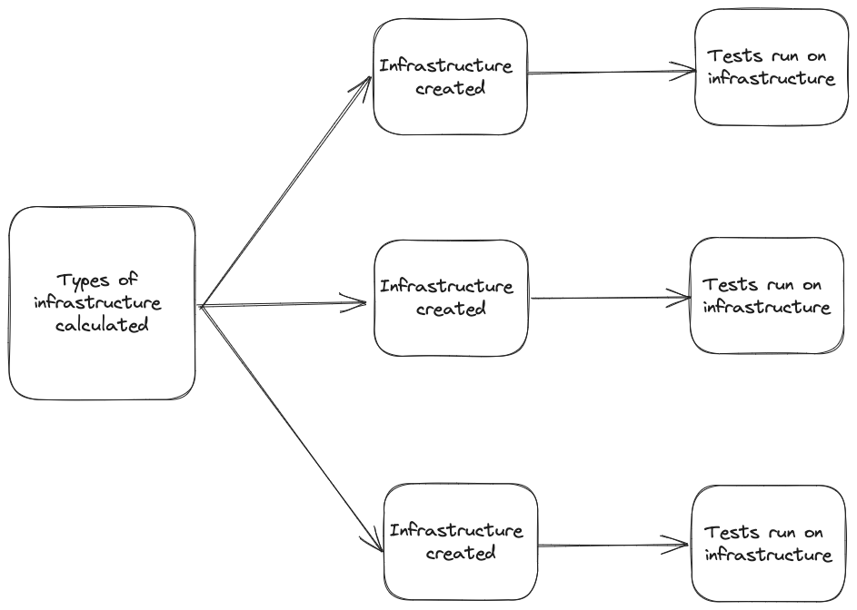

# E2E

E2E tests the operator's capabilities in a real AKS environment and also functions as integration tests ensuring each part of the operator works together.

E2E is ran automatically on every PR. See [GitHub Runner](#-github-runner).

You can also run E2E locally. See [Local E2E](#-local-e2e).

## Architecture

### Major Steps

E2e is designed so that every major step is run in a separate GitHub Job. This allows for easy retries and makes it a lot more obvious about which step failed. It also means logs are easier to read.



In the above diagram, each box is a GitHub Job. The arrows show the order in which the jobs are run. Essentially, each infrastructure step is run in parallel, and then the operator is installed and tested on each infrastructure. Infrastructure refers to the AKS cluster and the Azure resources needed for testing.

E2e can be run in the same way locally but typically only one kind of infrastructure will be chosen to be run locally. The separation of each major phase will be the same.

### Tests

The tests running on each infrastructure must be tested against a number of different scenarios. The major configuration option is the Operator Config which defines things like number of dns zones. Another key piece is that tests must test both upgrade and clean-deploy scenarios for the operator.

Each test defines a matrix of options it will run against including compatible operator versions and operator configs. Then when running tests a testing order is defined where each test with the same operator version and operator config run in parallel. Operator version is incremented appropriately to simulate an upgrade scenario.

For example, we might have the following tests

| Name   | Versions      | Public Dns Zones | Private Dns Zones |
|--------|---------------|------------------|-------------------|
| Test 1 | Latest, 0.0.3 | One, Multiple    | One               |
| Test 2 | Latest, 0.0.3 | One              | One               |

The testing order would be calculated as something like this.

1. Test 1 and 2, 0.0.3, One Public, One Private
2. Test 1, 0.0.3, Multiple Public, One Private
3. Test 1 and 2, Latest, One Public, One Private **(upgrade scenario)**
4. Test 1, Latest, Multiple Public, One Private **(upgrade scenario)**
5. Test 1 and 2, Latest, One Public, One Private **(fresh deploy scenario)**
6. Test 1, Latest, Multiple Public, One Private **(fresh deploy scenario)**

Each row represents the tests and operator configuration that is run in parallel. We wait for tests to finish running for an operator configuration before testing the next configuration.

## Adding new scenarios

Infrastructures are defined in [/testing/e2e/infra/infras.go](../testing/e2e/infra/infras.go). Add any new AKS cluster configurations here.

Tests are defined in [/testing/e2e/suites/](../testing/e2e/suites/). Add any new tests here. [This](../testing/e2e/suites/basic.go) is a good reference for defining a test. Be sure to add any new suites to the [all function](../testing/e2e/suites/all.go) so that they are run.


## GitHub Runner

todo: will fill in details when I add GitHub workflows to run new e2e

## Local E2E

Typically, when testing changes locally it's overkill to test changes on a wide variety of infrastructures, so you will most often filter down to a single infrastructure when testing locally.

Run e2e tests with the following commands.

```bash
go run ./main.go infra --subscription=<subscriptionId> --tenant=<tenantId> --names="basic cluster" # provisions the infrastructure and saves it to local config file
go run ./main.go deploy # deploys the testing job to the cluster and exits based on job status. also uploads logs to local file
```

You can replace `basic cluster` with the name of any infrastructure defined in [/testing/e2e/infra/infras.go](../testing/e2e/infra/infras.go). 