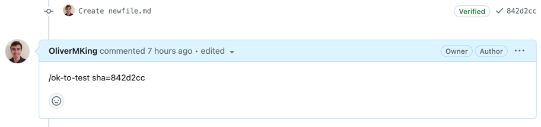

# Validating

Before submitting a pull request, you need to ensure that your changes work and don't cause regressions.

## Development Environment 

You can easily provision a development environment to test your changes on.

To run a single E2E suite, the user must run the following commands from the root of the project:
1. `make clean` to clear out any preexisting Terraform state.
2. `make dev` to deploy all Azure resources necessary to run a full suite, including a Kubernetes cluster that the operator will be deployed to. IMPORTANT: this does not start the add-on. The next step needs to be run for the add-on to be fully deployed with the correct image.
3. `make push` to build the add-on image according to the user's local state/branch and push it to the add-on deployment. This step can be re-run when changes to the local add-on are made and the user wishes to manually test those changes on a cluster.
4. `make e2e` to deploy the e2e tester job, which will run the e2e test suite inside the cluster.

By default, the `make dev` command will create an environment with a public cluster using a public DNS Zone. However, two arguments can be specified to change the type of the cluster and/or the zone: `CLUSTER_TYPE` and `DNS_ZONE_TYPE`. For instance, to run a suite with a private cluster and a public zone, a user can run `	make dev CLUSTER_TYPE=private DNS_ZONE_TYPE=public`.

Alternatively, to run a full suite with all possible configuration options, users can simply run `make public-cluster-test` for a public cluster and `make private-cluster-test` for private clusters. To run both, users can run `make all-tests`.

Region can be specified by exporting an env variable before running the `make dev` command. `export TF_VAR_location="East US"` sets the location to East US.

This development environment is useful for manually interacting with App Routing and automated E2E testing.

## E2E

E2E is a set of automated tests ran against a development environment that validate the functionality of the operator. 

A prerequisite for running E2E is to have a [Development Environment](#development-environment) running. Once your development environment is ready, you can simply run E2E with `make e2e`.

## Pull Requests

Pull requests must pass a validating GitHub workflow that runs both E2E and unit tests. These tests are triggered by a repository writer commenting `
/ok-to-test sha=<sha>`. Before commenting ensure that the PR doesn't contain malicious code. This comment must be posted every time you want the tests to retrigger. `<sha>` should be replaced by the latest sha of the PR.

